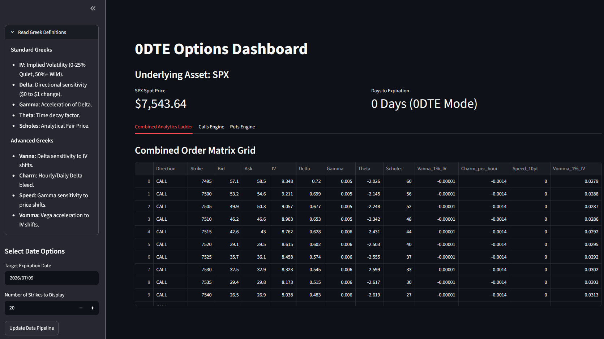

# OptionsDashboard

A Python and Streamlit options analytics dashboard for analyzing SPX option pricing, Greeks, and risk exposure.

This project was built as part of my quantitative finance portfolio as a Statistics and Economics student at UC Davis. The goal is to turn options concepts into practical tools that help traders understand payoff structure, volatility exposure, time decay, convexity, and position risk.

## Overview

OptionsDashboard analyzes SPX option contracts using live or structured option chain data. The dashboard calculates Black-Scholes theoretical price, standard Greeks, advanced Greeks, bid/ask quotes, implied volatility, and time-to-expiration metrics.

The project focuses on short-dated SPX options, including 0DTE-style analysis, where small changes in price, volatility, and time can meaningfully affect option value.

## Dashboard Preview

<!-- Add a screenshot after creating docs/screenshots/dashboard.png -->



## Current Features

- Streamlit dashboard for SPX options analytics
- Live options chain data pipeline using Schwab API through `schwabdev`
- Sample data support through `options_ladder.json`
- Black-Scholes option pricing
- Bid, ask, and mid-price extraction from option chain data
- Time-to-expiration calculation using 4:00 PM New York market close timing
- Standard Greeks:
  - Delta
  - Gamma
  - Theta
  - Vega
  - Rho
- Advanced Greeks:
  - Vanna
  - Charm
  - Speed
  - Vomma
- Scaled advanced Greeks:
  - Vanna per 1% implied volatility change
  - Charm per trading hour
  - Speed per 10-point SPX move
  - Vomma per 1% implied volatility change
- Support for calls and puts
- Risk-free rate input using 13-week Treasury yield data
- Interactive table views for combined options, calls, and puts

## Why This Project Matters

Options trading is not only about market direction. A trade can behave very differently depending on implied volatility, time decay, gamma exposure, and position sizing.

This project breaks down those risks by connecting option prices and Greeks to practical trading decisions. It also helped me build a stronger foundation in derivatives, Python, data analysis, API usage, and quantitative risk modeling.

## Tech Stack

- Python
- Streamlit
- pandas
- NumPy
- SciPy
- vollib
- yfinance
- schwabdev
- python-dotenv
- Plotly
- JSON

## Repository Structure

```text
OptionsDashboard/
├── api.py
├── dashboard.py
├── options.py
├── options_ladder.json
├── requirements.txt
├── README.md
└── docs/
    └── screenshots/
        └── dashboard.png
```

## File Overview

| File | Purpose |
|---|---|
| `api.py` | Connects to the Schwab API, fetches SPX option chain data, calculates risk-free rate data, and exports processed option data to JSON |
| `dashboard.py` | Runs the Streamlit dashboard and displays SPX option analytics |
| `options.py` | Defines the `Option` class and calculates Black-Scholes pricing, standard Greeks, and advanced Greeks |
| `options_ladder.json` | Sample or cached option-chain output used by the dashboard |
| `requirements.txt` | Python dependencies needed to run the project |

## How to Run

Clone the repository:

```bash
git clone https://github.com/brandonong07/OptionsDashboard.git
cd OptionsDashboard
```

Install dependencies:

```bash
pip install -r requirements.txt
```

Run the Streamlit dashboard:

```bash
streamlit run dashboard.py
```

Inside the dashboard, click **Update Data Pipeline** to fetch live SPX options data. If live API credentials are not configured, the app can still display data from the existing `options_ladder.json` sample file.

## Schwab API Setup

This project uses `schwabdev` to fetch live SPX options chain data from the Schwab API.

To run the live data pipeline, you need:

- A Schwab developer account
- A registered Schwab API application
- Your own app key, app secret, and callback URL
- A local `.env` file containing your credentials

Create a `.env` file in the root directory:

```text
app_key=YOUR_APP_KEY
app_secret=YOUR_APP_SECRET
url=YOUR_CALLBACK_URL
```

The `.env` file is intentionally excluded from GitHub for security. Do not commit API keys or credentials.

Your `.gitignore` should include:

```text
.env
```

## Methods

OptionsDashboard uses option-chain data to extract contract-level market information such as bid, ask, implied volatility, and Greeks. The project calculates mid-price from bid and ask quotes and uses Black-Scholes pricing to estimate theoretical option value.

Time to expiration is calculated using the selected option expiration date and a 4:00 PM New York market close assumption. This helps model short-dated options more precisely than using only whole calendar days.

The risk-free rate is estimated using the 13-week Treasury Bill yield through Yahoo Finance data.

The project also calculates advanced Greeks to better understand second-order risk:

- **Vanna:** sensitivity of delta to changes in implied volatility
- **Charm:** change in delta as time passes
- **Speed:** change in gamma as the underlying price moves
- **Vomma:** change in vega as implied volatility changes

These metrics are especially useful for short-dated options, where price behavior can change rapidly.

## Dashboard Sections

| Section | Purpose |
|---|---|
| Combined Analytics Ladder | Displays calls and puts in one options matrix |
| Calls Engine | Displays call-side option pricing and Greek exposure |
| Puts Engine | Displays put-side option pricing and Greek exposure |
| Sidebar Controls | Allows users to select expiration date, number of strikes, and update live data |

## Example Use Cases

- Compare market bid/ask quotes to Black-Scholes theoretical value
- Analyze delta, gamma, theta, and implied volatility across strikes
- Evaluate advanced Greek exposure in short-dated SPX options
- Study how charm and theta affect 0DTE option behavior
- Build a foundation for future options strategy analysis and backtesting

## Limitations

- This project is educational and is not financial advice.
- Black-Scholes assumes constant volatility, constant interest rates, and frictionless markets.
- Real option prices may differ from theoretical values because of liquidity, bid-ask spreads, dividends, volatility skew, and market microstructure effects.
- SPX options are European-style, but model assumptions may still differ from real market pricing.
- Current calculations depend on the structure and availability of Schwab option-chain data.
- Advanced Greeks are sensitive to time-to-expiration and implied volatility assumptions, especially for short-dated options.
- The project currently analyzes individual option contracts rather than multi-leg strategies.

## Future Improvements

- Add payoff diagrams for single-leg and multi-leg strategies
- Add scenario analysis for changes in SPX price, implied volatility, and time
- Add volatility smile visualization across strikes
- Add Greeks exposure charts across strikes and expirations
- Add support for multi-leg spreads
- Add position sizing and max-loss calculations
- Add historical backtesting for options strategies
- Add cleaner sample outputs and dashboard screenshots
- Add automated tests for pricing and Greek calculations

## What I Learned

This project helped me connect derivatives theory with practical software tools. I practiced working with option-chain data, API credentials, Streamlit dashboards, Black-Scholes pricing, Greeks, and second-order risk metrics.

It also strengthened my understanding of why short-dated options require careful attention to time decay, gamma exposure, implied volatility, and liquidity.

## Disclaimer

OptionsDashboard is an educational project and is not financial advice. It should not be used to make live trading decisions without independent verification and risk management.

## Candidate Signal

OptionsDashboard reflects my interest in quantitative finance, derivatives, trading tools, and risk analytics. I built this project to show that I can apply Python to financial data, connect theory to practical analytics, and communicate options risk through an interactive dashboard.
